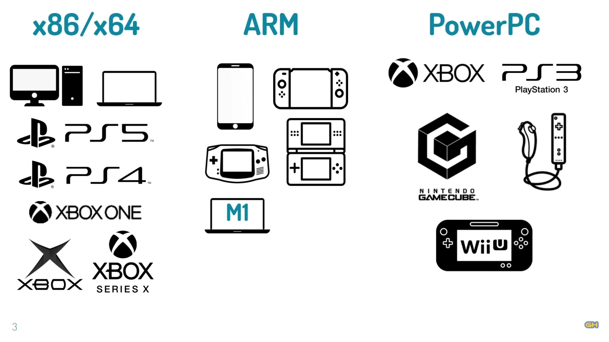
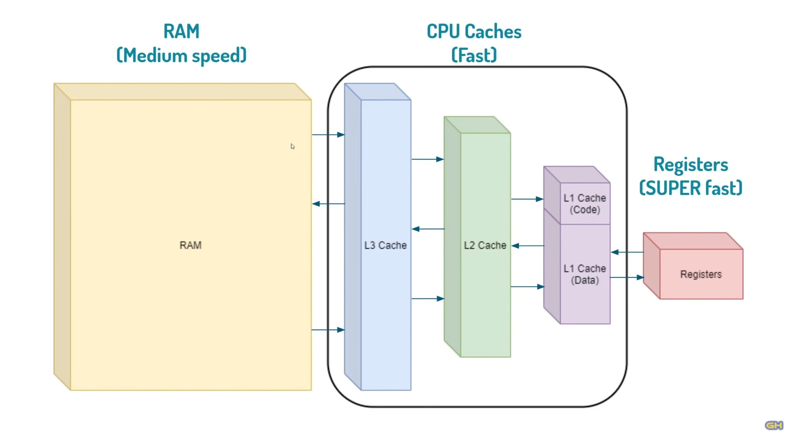
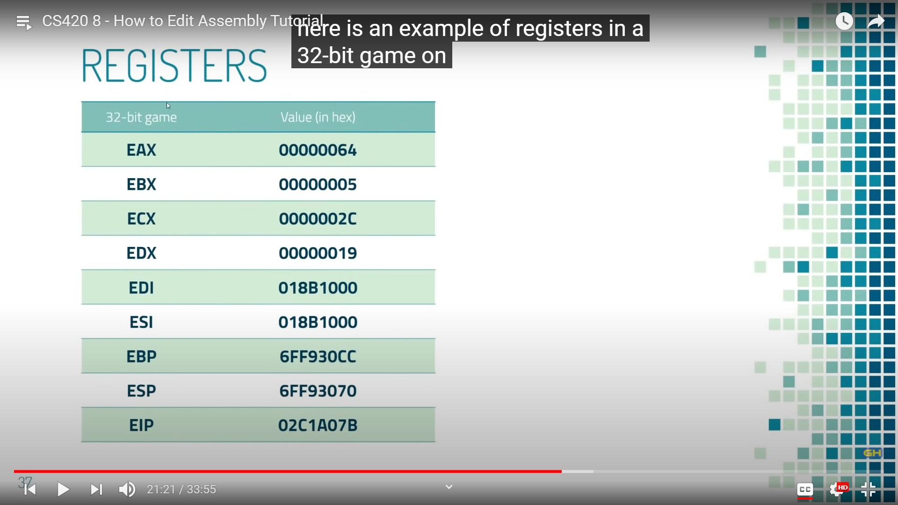

# Architectures

We are going to learn x86/x64 assembly.

# How to edit assembly

We can group bytes into assembly language instructions.

We can safely edit assembly language if the game is written in:
- C
- C++

It's risky to edit assembly language of
- C#
- Java

because it's not static

Scripting languages, like:
- Python
- JavaScript
- Ruby

they don't generate assembly at all

# Registers

- Temporary storage in the CPU, that is used by assembly language.

We shouldn't mess up with registers, ending in 'P'.

| 32-bit | 64-bit |       Usage        |
| :----: | :----: | :----------------: |
|  EAX   |  RAX   |    General Use     |
|  EBX   |  RBX   |    General Use     |
|  ECX   |  RCX   |    General Use     |
|  EDX   |  RDX   |    General Use     |
|  EDI   |  RDI   |    General Use     |
|  ESI   |  RSI   |    General Use     |
|  EBP   |  RBP   |  Use not advised   |
|  ESP   |  RSP   | Highly not advised |
|  EIP   |  RIP   | Highly not advised |
|        |   R8   |    General Use     |
|        |   R9   |    General Use     |
|        |  R10   |    General Use     |
|        |  R11   |    General Use     |
|        |  R12   |    General Use     |
|        |  R13   |    General Use     |
|        |  R14   |    General Use     |
|        |  R15   |    General Use     |

| Instruction Set |    Usage     | Example  |
| :-------------: | :----------: | :------: |
|  x86 Assembly   | 32-bit games | push eax |
|  x64 Assembly   | 64-bit games | push rax |

